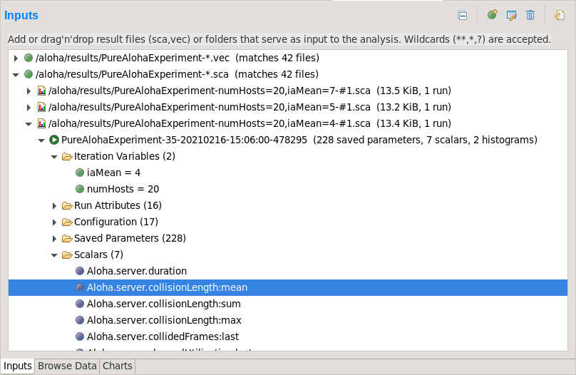
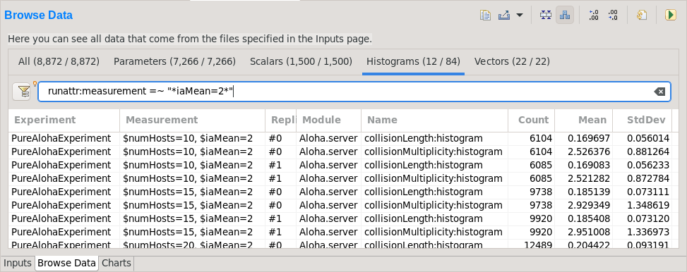
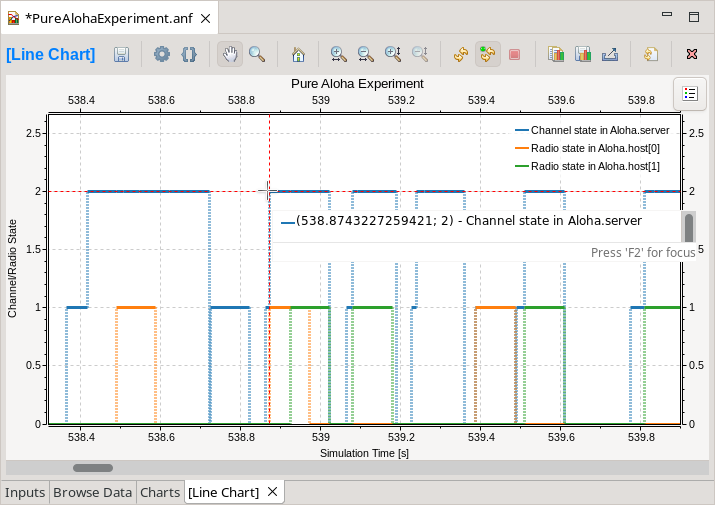
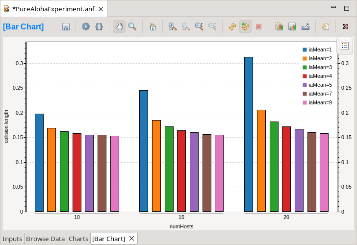
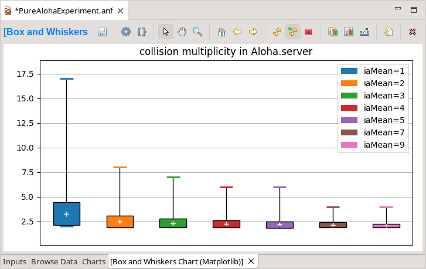
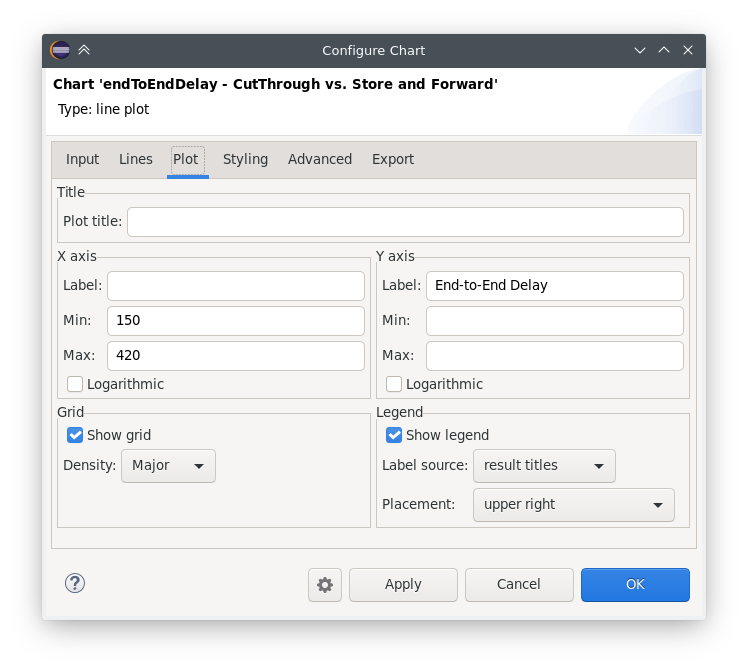
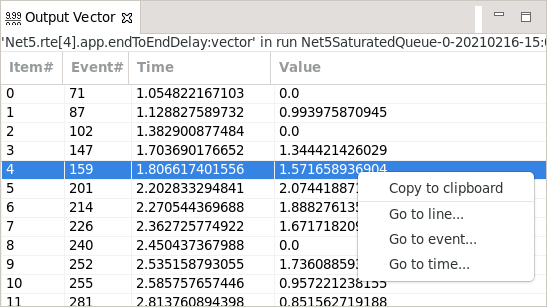

## Introduction

The OMNeT++ Integrated Development Environment is based on the Eclipse
platform, and extends it with new editors, views, wizards, and
additional functionality. OMNeT++ adds functionality for creating and
configuring models (NED and ini files), performing batch executions, and
analyzing simulation results, while Eclipse provides C++ editing,
GIT integration, and other optional features (UML modeling,
bugtracker integration, database access, etc.) via various open-source
and commercial plug-ins.

The following screenshots introduce the main components of the OMNeT++
IDE.

{: .captioned_image}
{: .materialboxed}
*The OMNeT++ IDE, editing a NED file*

## The NED Editor

The NED Editor can edit NED files both graphically or in text mode, and
the user can switch between the two modes at any time, using the tabs at
the bottom of the editor window.

{: .captioned_image}
{: .materialboxed}
*The NED Editor in graphical editing mode*

In graphical mode, one can create compound modules, channels, and other
component types. Submodules can be created using the palette of
available module types. Visual and non-visual properties can be modified
in the Properties View, or by dialogs invoked from the context menu. The
editor offers many features such as unlimited undo/redo, object cloning,
constrained move and resize, alignment of objects, and zooming.

Submodules can be pinned (having a fixed position), or unpinned
(auto-layout). Graphical features that can be edited are background
image, background grid, default icons (via display string inheritance),
icon sizing and coloring, transmission range, and many others.

{: .captioned_image}
{: .materialboxed}
*Properties view*

The Properties View lets the user edit graphical and non-graphical
properties of objects. Special cell editors facilitate selecting colors,
icons, etc. Undo and redo is supported for property changes too. The
Properties View is also used with other editors like the Result Analysis
editor, where it allows the user to customize charts and other objects.

{: .captioned_image}
{: .materialboxed}
*The NED Editor in source editing mode*

Text mode lets the user work with the NED source directly. When hitting
Ctrl+Space, the editor offers context-aware completion of keywords and
module type, parameter, gate, and submodule names. Template proposals to
insert full compound module skeletons, submodules, various connection
structures, etc. are also available. Documentation of referenced module
types can be viewed by hovering over the NED type name. The NED source
is continually parsed and validated as the user is typing, and errors
are displayed in real time on the left margin. Syntax highlighting,
automatic indentation, and automatic conversion from the OMNeT⁠+⁠+ 3.x
NED syntax are also provided.

{: .captioned_image}
{: .materialboxed}
*Outline View*

The Outline View shows the structure of NED files in both graphical and
text editing mode, and allows navigation, as well.

*Other Views:* The Module Hierarchy View
and the NED Parameters View can also be used with the NED Editor (they
will display the submodule hierarchy and the parameters of the selected
module or submodule) – these views will be described with the Ini File
Editor. Further related views are the Problems View (which displays
errors and warnings in NED files and other files), and Tasks View (which
shows a list of all FIXME and TODO comments found in NED files and other
source files.)

## The Ini File Editor

The Ini File Editor lets the user configure simulation models for
execution. It features both form-based and source editing.

{: .captioned_image}
{: .materialboxed}
*Form-based ini file editing*

The Ini File editor considers all supported configuration options and
offers them in several forms, organized by topics. Descriptions and
default values are displayed in tooltips, which can be made persistent
for easier reading. The structure of the ini file (sections and their
inheritance tree) is also visualized and editable via drag&drop and
dialogs. Validation and content assist (Ctrl+Space) are also provided
where needed. The editor supports unlimited undo/redo and automatic
conversion from OMNeT⁠+⁠+ 3.x ini files.

{: .captioned_image}
{: .materialboxed}
*The ini file source editor*

The text editor lets the user work with the ini file directly, which is
more efficient for advanced users than forms. Unlimited undo/redo,
syntax coloring, and completion of configuration keys, values, and
module parameter patterns (on Ctrl+Space) are provided. As the user
types, the file is continually analyzed and errors/warnings are
displayed in real time.

The editor considers all NED declarations (simple modules, compound
modules, channels, etc.) and can fully exploit this information to
provide diagnostics and assistance to the user. Looking at
the *network=* configuration key, it knows the
top-level compound module NED type, and internally builds a static
picture of the network by recursively enumerating the top-level module's
submodules, sub-submodules, sub-sub-submodules, etc., and continually
relates this information to the ini file contents. Thus, the editor
always knows which ini file keys match which module parameters, which
are the ini file keys that are unused (will not match anything), and
which module parameters are still open (i.e. have no value assigned
yet). It displays this information in tooltips, as warnings, and in
various views.

{: .captioned_image}
{: .materialboxed}
*The Add Missing Keys dialog*

To speed up the process of creating ini files from scratch, the editor
offers an *Add Missing Keys* dialog. After
clicking OK, the editor will insert ini file keys for all open NED
parameters. The user will only need to supply the values.

{: .captioned_image}
{: .materialboxed}
*Module Hierarchy View*

The Module Hierarchy View displays the submodule hierarchy of the
current configuration's network, together with the module's parameters.
It shows how module parameters obtain their values (from NED, by
applying a NED default value, or from the ini file). It is able to
resolve simple cases where a submodule type comes from a string
parameter (NED's *like* keyword). By using
the context menu, the user can go to the NED declaration of a module,
submodule, parameter, gate, or to the place where a parameter gets its
value (in NED or in the ini file).

The View can be pinned to a particular editor to prevent its contents
from changing when the user switches across NED and ini file editors.

{: .captioned_image}
{: .materialboxed}
*The NED Parameters View*

By default, the NED Parameters View displays the table of all unassigned
NED parameters in the current configuration's network and it can be
switched over to show all parameters, assigned or unassigned. For
assigned parameters, it shows how they obtain their values (from NED, by
applying a NED default value, or from the ini file). The user can open
the relevant places in the NED files or the ini file. This View can also
be pinned.

{: .captioned_image}
{: .materialboxed}
*The Problems View*

The Problems View presents errors, warnings, and info messages in NED
files, ini files, and other source files in a unified manner.
Double-clicking on an item opens the corresponding file and goes to the
error's location. The view's contents can be filtered in various ways
(current file, current project, all projects, by severity, etc).

*Other Views:* The Outline View displays
the list of sections in the current ini file and can be used for
navigation as well.

## Simulation Launcher

The OMNeT⁠+⁠+ IDE makes it possible to run simulations directly from the
integrated environment. It is possible to run a simulation as a normal
C/C++ application and perform C++ source-level debugging on it. The user
can also run it as a standalone application (under Qtenv or Cmdenv) or
run batches of simulations where runs differ in module parameter
settings or random number seeds.

{: .captioned_image}
{: .materialboxed}
*The Run dialog showing a simulation launch configuration*

In the Eclipse IDE, the various ways of launching a program under
development is described by launch configurations. There are various
launch configuration types (C/C++ Application, Java Application, etc.).
To launch a program for the first time, the user creates an instance of
a launch configuration, fills in a form (program name, command-line
arguments, etc.), and hits the Run button. OMNeT⁠+⁠+ provides launch
configuration types for simulations: one extends the normal “C/C++ Local
Application” launch type with a *Simulation* tab (for convenient editing of
simulation-related command-line options), and a standalone launch type
for launching a simulation or running simulation batches. The former can
be used for C++ debugging, as well.

The dialog shows a standalone launch type for the Aloha example
simulation model. Batch simulations can be launched by specifying more
than one run number in the dialog. Ini files allow the user to define
various scenarios iterating over a list of values for certain NED
parameters, and/or do multiple runs with different seeds. The launch
dialog helps the user select the desired run numbers by showing which
runs correspond to which parameters and seed settings.

Multi-processor or multi-core computers can be exploited by specifying
that more than one process may be launched (i.e. may be running) at a
time.

{: .captioned_image}
{: .materialboxed}
*Progress View*

The Progress View reports the status of simulation execution when you
have a long-running simulation, or you are executing several runs in a
batch. It is possible to cancel the whole batch operation with a single
click, if necessary. Simulations run in separate processes that do not
block the IDE, so users can keep working while their simulations run in
the background. In the above screenshot, the number of processes to run
in parallel was set to 2; run \#1 has already terminated (and is no
longer shown), run \#3 has already launched, and run \#2 is still
running.

{: .captioned_image}
{: .materialboxed}
*Console View*

Each running process sends its output to a separate console buffer
within the Console View, so the user can review the output after a
simulation has finished. One can switch between console buffers using
the Console View's menu or toolbar, or by double-clicking on a process
in the Debug View.

{: .captioned_image}
{: .materialboxed}
*The Debug View showing three runs in a simulation batch*

The Debug View is another one of Eclipse's standard Views, but it is not
only useful for debugging. While the Progress View only shows currently
executing processes, the Debug View displays the ones already
terminated, as well, together with their exit codes. Processes are
marked with run numbers and launch times for easier identification.
Double-clicking an item reveals the process output in the Console View.

## Sequence Chart

The OMNeT⁠+⁠+ simulation kernel is capable of logging various events
during simulation: scheduling and canceling self-messages, sending
messages, display changes, module and connection creation and deletion,
user log messages, etc. The result is an event log file which contains
detailed information of the simulation, and later can be used for
various purposes, such as visualizing message exchanges among modules on
a sequence chart. The file format is line-based text to facilitate
processing by third party tools.

{: .captioned_image}
{: .materialboxed}
*A Sequence Chart showing ARP on a wireless network*

An event log can be visualized with the Sequence Chart in the IDE. On
the Sequence Chart, events are represented as nodes, and message
send/schedule/reuse operations as arrows. The chart can be filtered
according to modules, message types, and various other criteria. The
chart can also be filtered according to the causes/consequences of a
particular event (this works by following message arrows backward and
forward in simulation time). The chart timeline can be displayed in
various modes, such as linear (simulation time), compact (non-linear),
and event number-based. Other features include sorting of module axes,
displaying state vector data on axes (using output vector files),
zooming, and special navigation options (bookmarks, zoom to message
send, follow message send), and exporting the chart in SVG format.

Both the Event Log Table and the Sequence Chart are capable of
efficiently displaying event log files of several gigabytes without
requiring large amounts of memory.

{: .captioned_image}
{: .materialboxed}
*The Event Log View*

The Event Log Table displays the content of an event log file recorded
during a simulation. It supports raw and descriptive notations,
line-based filtering for event log entry types and various parameters,
search for free text, bookmarks, and special navigation options such as
"go to simulation time" or message arrival. The Event Log Table supports
the same filtering as the Sequence Chart.

## Result Analysis

Simulations record their results into *vector* (for time series data) and
*scalar* files (for scalars, histograms, statistical summaries, etc). These
result files can be browsed and analyzed in the Python-powered Analysis Tool in
the IDE. The Analysis Tool works equally well on the output of a single
simulation run and the output from parameter studies or simulation batches which
may be several hundred files, possibly in multiple directories.

{: .captioned_image}
{: .materialboxed}
*Specifying input files for data analysis*

The first page in the editor is where the user can select input files for
analysis. It lets the user edit a set of file name patterns or directory names
that specify which result files to load. When the IDE expands the patterns, it
displays the list of matched files under each one. The contents of files are
also displayed in a tree structure.

{: .captioned_image}
{: .materialboxed}
*Browsing simulation results*

The second page of the Analysis editor displays results (parameters, scalars,
histograms, and vectors) from all files in tables and lets the user browse them.
Results can be sorted and filtered. Simple filtering is possible with combo
boxes, or when that is not enough, the user can write filter expressions in a
generic pattern-matching expression language. Selected or filtered data can be
immediately plotted.

{: .captioned_image}
{: .materialboxed}
*Managing charts in the analysis*

The third page displays the charts created during the analysis as icons. Charts
can be selected, reordered by dragging, copied, pasted, renamed, deleted,
opened, etc.

New charts are selected from a Chart Gallery, which contains a set of
pre-defined charts for the most frequent needs. Charts are backed by Python
scripts, which use the Pandas DataFrame as the central data structure. The user
can freely edit the script of a chart, and can also save the result into the
Chart Gallery for reuse as a new chart type. Charts are configured by dialogs
that let the user select the data to be plotted, item colors, line types,
markers, axis titles and more. (These settings are stored as chart *properties*
that the script can access and take into account.) Plots are drawn either with
the Matplotlib library or using the built-in plotting capabilities of the IDE.

Since charts select their input from the result files using a filter expression,
existing charts do not need to be re-created when the simulations are re-run --
they will automatically update and display the new data.

{: .captioned_image}
{: .materialboxed}
*A Line Chart*

Line charts are typically drawn from time series data stored in vector files.
Pre-processing of the data is possible in the script. The line chart component
can be configured freely to display the vector data according to your needs.

{: .captioned_image}
{: .materialboxed}
*A Bar Chart*

Bar charts are created from scalar results or scalar statistics of vectors or
histograms. Relevant data can be grouped, and several display attributes can be
set on the component.

{: .captioned_image}
{: .materialboxed}
*A Box and Whiskers Chart*

This chart is just one example of the many types of charts that can be made
using the integrated support for Matplotlib. It offers dozens of plot types out
of the box, endless customizations, and proven high-quality output.

{: .captioned_image}
{: .materialboxed}
*Chart Properties Dialog*

Charts have a set of properties that define their behavior and looks. These
properties can be edited in a configuration dialog. For many input fields,
autocompletion and smart suggestions are available.

{: .captioned_image}
{: .materialboxed}
*Chart Script Editor*

With the embedded code editor, users are free to make any changes to the Python
scripts powering each chart. The integrated editor is that of the PyDev project.
It provides syntax highlighting, code navigation features, helpful tooltips, and
code completion suggestions.

{: .captioned_image}
{: .materialboxed}
*Output Vector View*

The Output Vector View can be used to inspect the raw numerical data when
required. The user can select a vector on the Browse Data Page, and its content
will be displayed here.

